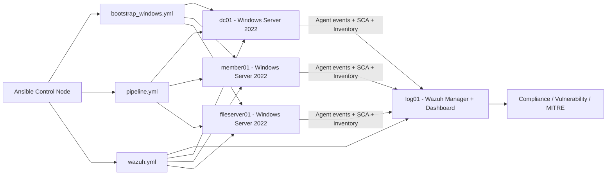

# NT542.Q22 - Đồ án cuối kì
# TRIỂN KHAI BẢO MẬT CHO HỆ THỐNG WINDOWS SERVER 2022 THEO TIÊU CHUẨN CIS BENCHMARK 

## 1. Tổng quan


## 2. Các hạng mục triển khai

| Thành viên | Hạng mục | Các mục CIS phụ trách | Trọng tâm rủi ro |
| --- | --- | --- | --- |
| **Như Trang** | Identity & Access Control | `Mục 1 - Account Policies` <br>`Mục 2.2 - User Rights Assignment`<br>`Mục 2.3.1 - Security Options (Accounts)` | Brute-force và leo thang đặc quyền |
| **Trung Kiên** | Network & Services Security | `Mục 5 - System Services`<br>`Mục 9 - Windows Defender Firewall`<br>`Mục 18.6 - Administrative Templates (Network)` | Tấn công qua mạng, khai thác dịch vụ (PrintNightmare) |
| **Phú Thuận** | Auditing & Monitoring | `Mục 17 - Advanced Audit Policy Configuration`<br>`Mục 18.10.26 - Event Log Service`<br>`Mục 2.3.2 - Audit (Security Options)` | Thiếu bằng chứng điều tra, không phát hiện xâm nhập |
| **Tiến Phát** | System Hardening & Antimalware | `Mục 18.10.42 - Microsoft Defender Antivirus`<br>`Mục 18.4 & 18.5 - MS Security Guide & MSS (Legacy)`<br>`Mục 2.3.17 - User Account Control (UAC)`<br>`Mục 18.9.5 - Device Guard`<br>`Mục 18.9.27 - Local Security Authority (LSA)`<br>`Mục 18.10.8 - AutoPlay Policies`<br>`Mục 18.9.13 - Early Launch Antimalware (ELAM)`<br>`Mục 18.10.77 - Windows Defender SmartScreen` | Mã độc thực thi trái phép, đánh cắp chứng thực cục bộ |

## 3. Triển khai các công cụ

### 3.1 Wazuh
Wazuh được triển khai như một nền tảng giám sát an ninh tập trung cho hệ thống Windows Server trong lab. Trong kiến trúc của nhóm, `log01` đóng vai trò Wazuh manager/dashboard, còn các máy Windows như `dc01` và `member01` được cài Wazuh agent để gửi log, trạng thái hệ thống và kết quả đánh giá bảo mật về trung tâm.

Việc tích hợp Wazuh giúp nhóm không chỉ dừng ở bước hardening theo CIS, mà còn có thêm một lớp giám sát vận hành sau triển khai. Thông qua dashboard, nhóm có thể theo dõi tình trạng online/offline của agent, kết quả `Security Configuration Assessment (SCA)`, thông tin `Vulnerability Detection`, cũng như quan sát các thay đổi cấu hình hoặc sự kiện bảo mật trên từng máy.

Trong quy trình triển khai hiện tại, Wazuh được tự động hóa bằng Ansible. Sau khi các máy Windows được bootstrap kênh quản trị từ xa, playbook sẽ cài Wazuh agent lên từng máy và kết nối chúng về manager. Nhờ đó, hệ thống có thể được đánh giá tập trung, hỗ trợ đối chiếu trước/sau hardening, và tăng giá trị thực tiễn cho đồ án theo hướng giám sát liên tục thay vì chỉ cấu hình một lần.

#### Lệnh setup Wazuh
Chạy các lệnh sau trong thư mục `ansible`:

```bash
cd ansible
ansible-playbook playbooks/bootstrap/bootstrap_windows.yml
ansible-playbook playbooks/wazuh/wazuh.yml
```

Trong đó:
- `bootstrap/bootstrap_windows.yml`: mở và duy trì kênh quản trị từ xa trên các máy Windows
- `wazuh/wazuh.yml`: chạy toàn bộ quy trình cài `Wazuh manager` trên `log01` và `Wazuh agent` trên các máy Windows

Nếu cần chạy tách riêng từng phần, có thể dùng:

```bash
cd ansible
ansible-playbook playbooks/wazuh/wazuh_server.yml
ansible-playbook playbooks/wazuh/wazuh_agent.yml
```

#### Tài khoản mặc định của Wazuh dashboard
Role `wazuh_manager` hiện đã tự đặt mật khẩu dashboard theo biến trong `group_vars/log_servers.yml`.

Thông tin mặc định hiện tại:
- user: `admin`
- password: `AdminWazuh9*`

### 3.2 HardeningKitty

Để tránh commit 2 file module quá lớn, tải tự động từ upstream trước khi chạy pipeline:

```bash
mkdir -p tooling/hardeningkitty/module
curl -fsSL -o tooling/hardeningkitty/module/HardeningKitty.psd1 \
  https://raw.githubusercontent.com/0x6d69636b/windows_hardening/master/HardeningKitty.psd1
curl -fsSL -o tooling/hardeningkitty/module/HardeningKitty.psm1 \
  https://raw.githubusercontent.com/0x6d69636b/windows_hardening/master/HardeningKitty.psm1
```

## 4. Triển khai quy trình benchmark
