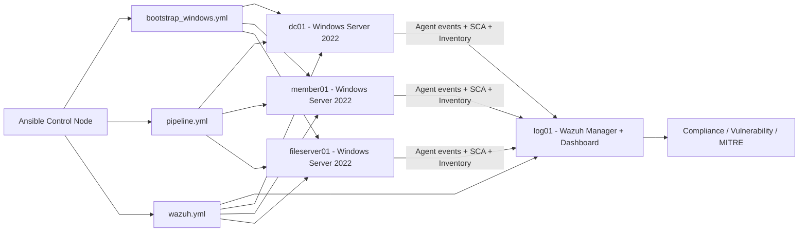

# NT542.Q22 - Đồ án cuối kì
# TRIỂN KHAI BẢO MẬT CHO HỆ THỐNG WINDOWS SERVER 2022 THEO TIÊU CHUẨN CIS BENCHMARK 

## 1. Tổng quan


## 2. Các hạng mục triển khai

| Thành viên | Hạng mục | Các mục CIS phụ trách | Trọng tâm rủi ro |
| --- | --- | --- | --- |
| **Như Trang** | Identity & Access Control | `Mục 1 - Account Policies` <br>`Mục 2.2 - User Rights Assignment`<br>`Mục 2.3.1 - Security Options (Accounts)` | Brute-force và leo thang đặc quyền |
| **Trung Kiên** | Network & Services Security | `Mục 5 - System Services`<br>`Mục 9 - Windows Defender Firewall`<br>`Mục 18.6 - Administrative Templates (Network)` | Tấn công qua mạng, khai thác dịch vụ (PrintNightmare) |
| **Phú Thuận** | Auditing & Monitoring | `Mục 17 - Advanced Audit Policy Configuration`<br>`Mục 18.10.26 - Event Log Service`<br>`Mục 2.3.2 - Audit (Security Options)` | Thiếu bằng chứng điều tra, không phát hiện xâm nhập |
| **Tiến Phát** | System Hardening & Antimalware | `Mục 18.10.42 - Microsoft Defender Antivirus`<br>`Mục 18.4 & 18.5 - MS Security Guide & MSS (Legacy)`<br>`Mục 2.3.17 - User Account Control (UAC)`<br>`Mục 18.9.5 - Device Guard`<br>`Mục 18.9.27 - Local Security Authority (LSA)`<br>`Mục 18.10.8 - AutoPlay Policies`<br>`Mục 18.9.13 - Early Launch Antimalware (ELAM)`<br>`Mục 18.10.77 - Windows Defender SmartScreen` | Mã độc thực thi trái phép, đánh cắp chứng thực cục bộ |

## 3. Triển khai môi trường thực nghiệm

Hạ tầng lab được triển khai bằng Terraform theo 2 stack tách biệt:
- `kvm/terraform/windows`: tạo 3 máy Windows (`dc01`, `member01`, `fs01`) và network dùng chung `windows-lab-net`
- `kvm/terraform/linux/wazuh`: tạo máy Linux `log01` chạy Wazuh và nối vào cùng network

Lưu ý quan trọng: phải `apply` stack Windows trước, sau đó mới `apply` stack Linux để bảo đảm network `windows-lab-net` đã tồn tại.

### 3.1 Triển khai hạ tầng Windows

Chạy từ thư mục gốc repository:

```bash
cd kvm/terraform/windows
terraform init
terraform apply --auto-approve
```

Kết quả sau khi apply:
- Tạo network `windows-lab-net`
- Tạo 3 VM Windows: `dc01`, `member01`, `fs01`
- Sinh inventory Ansible cho Windows tại `ansible/inventories/vm/windows.ini`

### 3.2 Triển khai hạ tầng Linux (Wazuh)

```bash
cd kvm/terraform/linux/wazuh
terraform init
terraform apply --auto-approve
```

Kết quả sau khi apply:
- Tạo VM Linux `log01`
- Nối `log01` vào `windows-lab-net`
- Sinh inventory Ansible cho Linux tại `ansible/inventories/vm/log_server.ini`

### 3.3 Xóa và tạo lại môi trường

Khi cần reset lab, nên destroy theo thứ tự ngược lại:

```bash
cd kvm/terraform/linux/wazuh
terraform destroy --auto-approve

cd ../../windows
terraform destroy --auto-approve
```

Sau đó apply lại theo đúng thứ tự: `windows` trước, `linux/wazuh` sau.

## 4. Triển khai các công cụ

### 4.1 Wazuh
Wazuh được triển khai như nền tảng giám sát tập trung cho toàn bộ lab. Trong kiến trúc của nhóm, `log01` đóng vai trò `Wazuh manager/dashboard`, còn `dc01`, `member01`, `fs01` chạy `Wazuh agent` để gửi log, inventory và kết quả SCA.

Việc tích hợp Wazuh giúp theo dõi trạng thái sau hardening theo thời gian thực: online/offline agent, cảnh báo bảo mật, kết quả `Security Configuration Assessment (SCA)` và `Vulnerability Detection`.

Lý do lựa chọn Wazuh trong đồ án:
- `Ansible` và `Wazuh` không trùng vai trò mà bổ trợ cho nhau. `Ansible` là công cụ **thực thi thay đổi cấu hình** hàng loạt (audit/remediate/post-audit), còn `Wazuh` là công cụ **giám sát liên tục** sau khi cấu hình đã áp dụng.
- Nếu chỉ dùng Ansible pipeline, hệ thống chủ yếu được kiểm tra tại thời điểm chạy playbook; các thay đổi phát sinh ngoài ý muốn sau đó (drift cấu hình, tắt dịch vụ bảo mật, thay đổi policy thủ công) có thể không được phát hiện ngay.
- Wazuh cung cấp lớp vận hành SOC cơ bản cho lab: thu thập sự kiện tập trung, theo dõi mức tuân thủ theo thời gian, cảnh báo khi có dấu hiệu lệch chuẩn hoặc rủi ro mới.
- Việc thêm Wazuh góp phần hoàn thiện vòng đời bảo mật theo mô hình: `Triển khai (Ansible) -> Giám sát liên tục (Wazuh) -> Cảnh báo/điều chỉnh`.

#### Lệnh setup Wazuh
Chạy trong thư mục `ansible`:

```bash
cd ansible
ansible-playbook -i inventories/vm/windows.ini playbooks/bootstrap/bootstrap_windows.yml
ansible-playbook -i inventories/vm/log_server.ini -i inventories/vm/windows.ini playbooks/wazuh/wazuh.yml
```

Trong đó:
- `bootstrap/bootstrap_windows.yml`: bootstrap kênh WinRM trên các máy Windows
- `wazuh/wazuh.yml`: cài `Wazuh manager` trên `log01` và `Wazuh agent` trên các máy Windows

Nếu cần chạy tách:

```bash
cd ansible
ansible-playbook -i inventories/vm/log_server.ini playbooks/wazuh/wazuh_server.yml
ansible-playbook -i inventories/vm/log_server.ini -i inventories/vm/windows.ini playbooks/wazuh/wazuh_agent.yml
```

#### Tài khoản mặc định Wazuh dashboard
- user: `admin`
- password: `AdminWazuh9*`

### 4.2 HardeningKitty
Để tránh commit module lớn, tải tự động từ upstream trước khi chạy pipeline:

```bash
mkdir -p tooling/hardeningkitty/module
curl -fsSL -o tooling/hardeningkitty/module/HardeningKitty.psd1 \
  https://raw.githubusercontent.com/0x6d69636b/windows_hardening/master/HardeningKitty.psd1
curl -fsSL -o tooling/hardeningkitty/module/HardeningKitty.psm1 \
  https://raw.githubusercontent.com/0x6d69636b/windows_hardening/master/HardeningKitty.psm1
```

## 5. Triển khai quy trình benchmark
